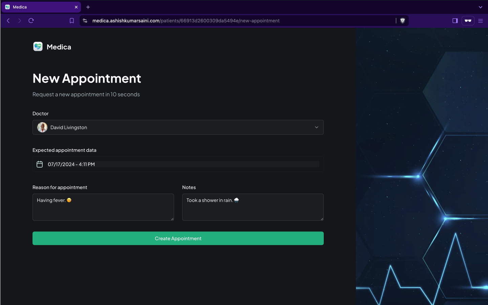

# Medica

### Home Page

### New Appointment

### Admin Dashboard

## Introduction

Medica provides a seamless solution for booking doctor appointments and managing them efficiently. Patients can easily schedule appointments with their preferred doctors through a user-friendly interface. Additionally, the app features a comprehensive appointment management dashboard for doctors and administrators, equipped with all the necessary functionalities to handle appointments effectively. This ensures a smooth and organized experience for both patients and healthcare providers.

## Functionalities

- **User Registration**: A user can register multiple patients.
- **Appointment Creation**: A patient can create multiple appointments.
- **Admin Dashboard**: Admins can view all appointments and their statuses. They can schedule or cancel appointments through the dashboard. Admin login requires a passkey: `123456`.

## Production Link

Access the app at [Medica](https://medica.ashishkumarsaini.com).

## Tech Stack

The app is built using the following technologies:

- Next.js
- Appwrite
- Shadcn
- React
- Tailwind CSS
- TypeScript
<!--
## Screenshots and Demonstration

Check out [video demonstration](#) of the platform.

## Monitoring

This app uses Sentry for monitoring and error tracking. Sentry integration ensures that we can catch and fix errors quickly, providing a better user experience.
-->
## Coming Soon

- **Phone Number Verification using OTP**: This feature will allow users to verify their phone numbers using OTP. Currently, it only works with phone numbers added in Twilio.

For any further questions or issues, feel free to reach out.
## Contact
- 📧 Email: [ashishsaini.ak@gmail.com](mailto:ashishsaini.ak@gmail.com)
- 🌐 Portfolio: [https://ashishkumarsaini.com](https://ashishkumarsaini.com)
